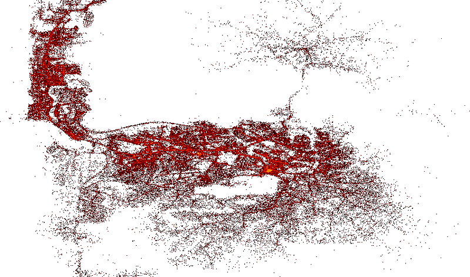

# Logistic-optimization-Delivery-drivers-location-optimisation-with-Causal-Inference-

## Objective

Gokada - the largest last mile delivery service in Nigeria. Gokada Works is partnered with motorbike owners and drivers to deliver parcels across Lagos, Nigeria. Gokada has completed more than a million deliveries in less than a year, with a fleet of over 1200 riders.
One key issue Gokada has faced as it expands its service is the sub-optimal placement of pilots (Gokada calls their motor drivers pilots) and clients who want to use Gokada to send their parcel. This has led to a high number of unfulfilled delivery requests.
Gokada is asking , to work on its data to help it understand the primary causes of unfulfilled requests as well as come up with solutions that recommend drivers locations that increase the fraction of complete orders. Since drivers are paid based on the number of requests they accept, your solution will help Gokada business grow both in terms of client satisfaction and increased business.

## Tasks

### Data Overview

For this project, there are two datasets that I have access to. The first dataset contains information about the accepted orders, including the trip ID, the trip origin location, the trip destination location, the start time of the trip, and the end time of the trip.
The second dataset contains information about the drivers' actions on the orders. This includes the order ID, whether the driver accepted or rejected the order, the latitude and longitude of the location when the driver received the order, and the driver's ID. There are also "created at" and "updated at" columns, but those columns are currently empty.

### Data Preparation

- Dealing with null values
- Dealing with outliers

### Adding features

Adding features to constract casual model

- Weather Data (Rainy, sunny and cloudy days)
- Date type (Weekdays vs weekends)
- Speed, distance and time of delivery
- Holidays

### Casual model

using casuaNex library to draw the casual graph.

- Using CasualNex to discover casuality
- Using domain knowladge to build casuality stracture
- Answering buisness question using the do calculus
- Predictions for order fulfilment

### Installaions

- Pandas
- matplotlib
- scipy
- seaborn
- folium
- dowhy
